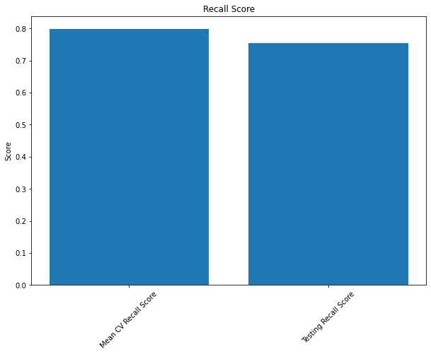
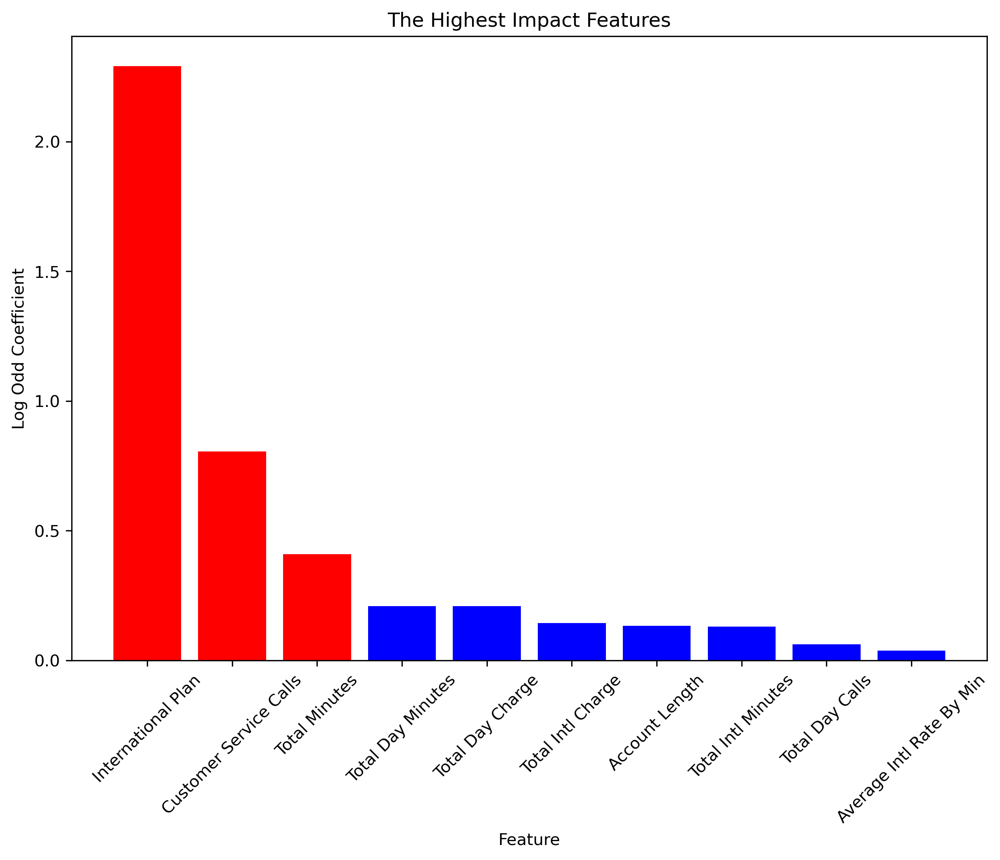

# Overview

We are a data science consulting company named M&Y Consulting Services, LLC looking to provide predictive and actionable insights regarding likely churn candidates at the telecommunications company SyriaTel. We hope to create a complex model that can predict likely churn candidates as well as the features that impact churn the most. 

Our presentation, where we analyze out dataset can be found at: ["A Study on Churn and Retention Rates"](Phase_3_Presentation.pdf)

# Business Problem 

Telecommunication services have increased dramatically due to the growing demand among consumers as many businesses require telecommunication services in order to help their business expand. This has led to communications becoming one of the most competitive and fastest-growing industries in the globe. Despite that there are some policies to reduce the rivalry among big corporations, the competition among companies in the telecom industry has been intensified in recent years. In the US, the telecom market continues to witness intense pricing competition. As one of the many telecom companies, SyriaTel is competing with other world top telecom companies such as AT&T, Verizon, Comcast, etc. and they are currently looking for a solution to retain as many customers as they can as churn rates have been rising steadily-likely due to inflation. As a solution, we are going to make several predictive models using a Classification to help SyriaTel identify the potential churn customers using the recall score. We're focusing on the recall score because we're looking to minimize the false negatives while also identifying churn candidates.

# Data Understanding

We are sourcing the data for this project from the SyriaTel dataset, which can be found at ["SyriaTel Dataset"](https://www.kaggle.com/datasets/becksddf/churn-in-telecoms-dataset)

In total, we reviewed 3,333 data points from this SyriaTel data set. Our visualizations can also be found seperately in the images folder located in this repository. We will analyze a list of variables from the SyriaTel data such as whether or not the customer has an international plan or voice mail plan, number of voicemail messages, total calling minutes, the state the customer lives in, and charge rates for each time of the day. Limitations of the data include possible overfitting, dealing with an outdated and a narrow data set, data imbalance, and possible outliers.

# Classification Modeling Results 

In our best model we are looking for the model that produces the highest recall score. We are focused on the recall score of our model since we are aiming to identify all likely churn candidates. We are placing less importance on finding the true negatives because we are primarily interested in spotting the real churners (true positives) as often as possible.

# Conclusion 
Our best model had a cross-validated recall score of .80, and a recall score of .75 when the model was run against our unseen test data.

We found the top three features that influence the customer churn most are: International Plan Rate, Number of Service Calls, and Total Minutes.

# Repository Contents
